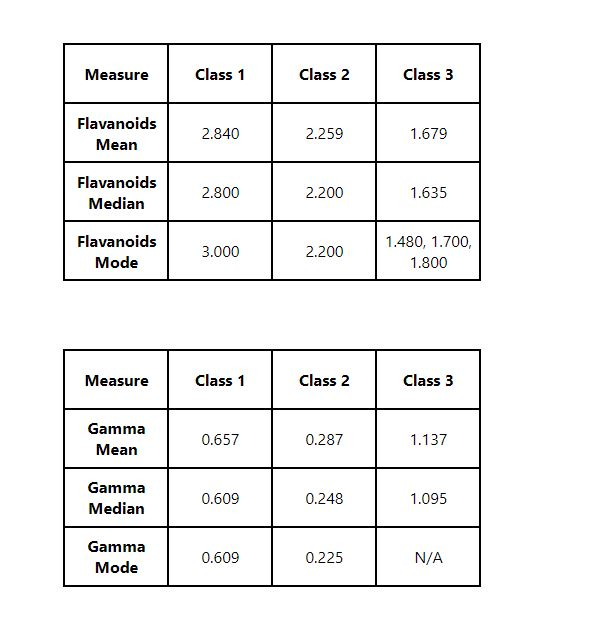

## About the project

This project reads wine data stored in [data.json](./src/data/data.json) and returns statistics for the wine. The statistics calculated are shown as two tables.
The firts table shows statics for Flavanoids and the second table shows statics for Gamma.

## Built With
The project is build with [React](https://react.dev/) and [Typescript](https://www.typescriptlang.org/).

## Installation
In the project directory, you can run in terminal:

### `git clone https://github.com/rjkumar1308/wine-statics.git`
This will clone the repo

### `yarn install`
This wil install all the dependencies for the project

### `yarn start`

Runs the app in the development mode.\
Open [http://localhost:3000](http://localhost:3000) to view it in the browser.

The page will reload if you make edits.\
You will also see any lint errors in the console.

### `yarn build`

Builds the app for production to the `build` folder.\
It correctly bundles React in production mode and optimizes the build for the best performance.

The build is minified and the filenames include the hashes.\
Your app is ready to be deployed!

See the section about [deployment](https://facebook.github.io/create-react-app/docs/deployment) for more information.
